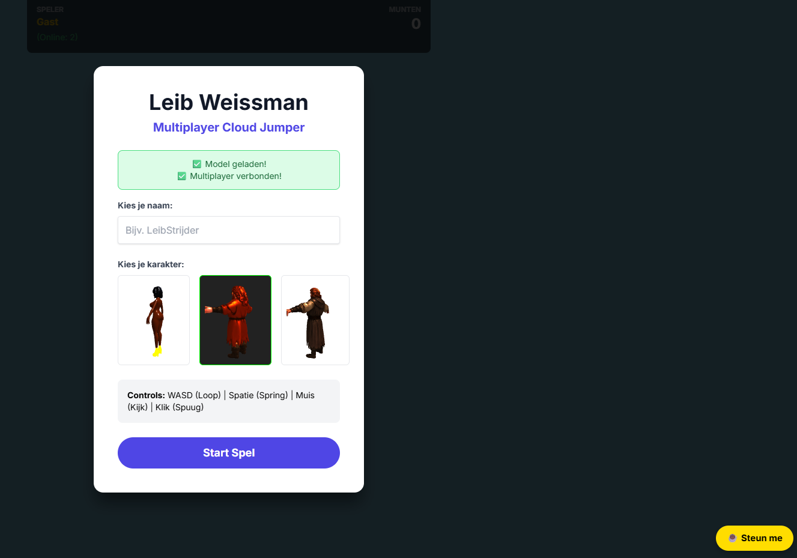
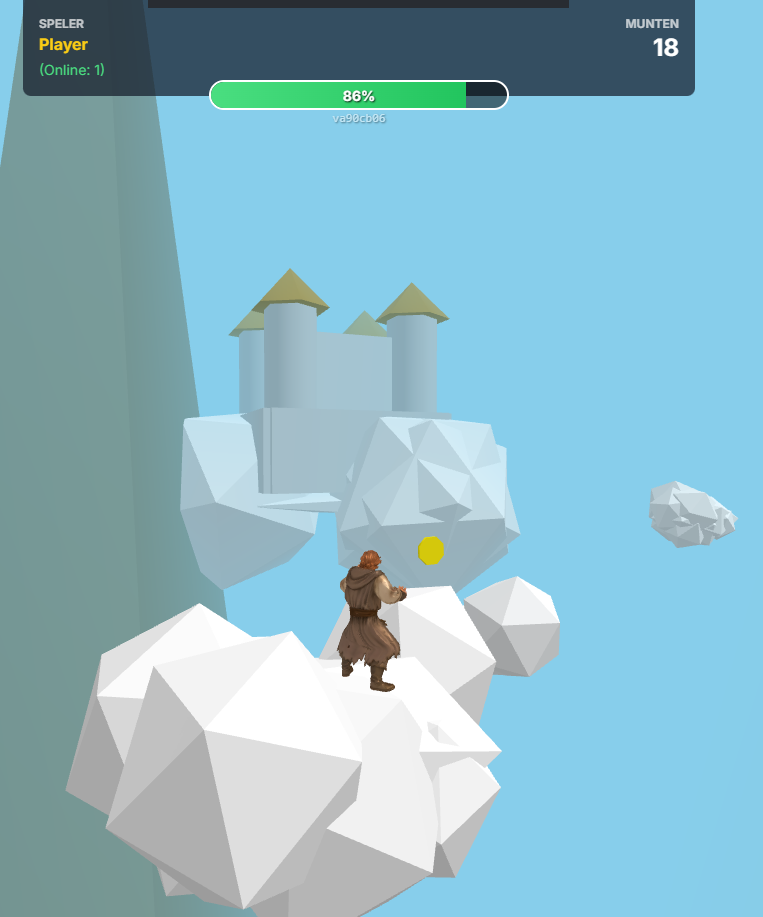

# Leib the Game

A third-person RPG platformer.

*Can you reach the castle of King Willem?*

## 📚 Content
* [✨ Amazing Features](#-amazing-features)
* [🎮 Controls](#-controls)
* [🛒 The Shop (Ronnie's Market)](#-the-shop-ronnies-market)
* [⚙️ Advanced Settings](#%EF%B8%8F-advanced-settings)
* [🖼️ Images](#%EF%B8%8F-images)
* [🛠️ Local Setup](#%EF%B8%8F-local-setup)
* [🎨 Development & Assets](#-development--assets)
* [🧪 Playwright Tests](#-playwright-tests)
* [👥 Authors](#-authors)

## ✨ Amazing Features

* **Platforming Action:** Jump across clouds, dodge enemies, and navigate procedural worlds.
* **Combat System:** Spit at enemies to turn them into collectable Stars.
* **Special Abilities:** Unlock powerful moves like **Double/Triple Jump**, **Cloud Summoning**, and **Gliding**.
* **Trip Mode:** A unique visual and gameplay modifier that alters gravity and atmosphere.
* **Multiplayer:** See other players in real-time, complete with synchronized animations and character models.
* **Progression System:** Collect Coins and Stars to trade with **Ronnie**, the mysterious merchant.
* **Account Sync:** Play anonymously or link your email to save your coins, stars, and unlocked upgrades across devices.
* **Atmosphere:** Dynamic Day/Night cycles, fog systems, and interactive particle effects.
* **Complete weather system:** Will you spot the UFO's? see the starry night sky with the constellations or maybe get your trip on with the rare magic particles. Warning: chance of snow ☃️
* **Katinka & Marco:** De enige echte Katinka! (pas op, marco is een smeerlap!)
* **Ronnie store:** Ronnie R Rietman kan soms verschijnen. Maak zo veel mogelijk deals met hem! Hij weet alles te regelen.

## 🎮 Controls

The game supports both Desktop and Mobile (touch) controls. Keybinds are fully rebindable in the Settings menu.

| Action | PC (Default) | Mobile |
| :--- | :--- | :--- |
| **Move** | `W`, `A`, `S`, `D` | Left Joystick |
| **Look** | Mouse | Drag Right Screen |
| **Jump** | `Space` | Double Tap Right Screen |
| **Sprint** | `Shift` | (Auto-run based on stick) |
| **Shoot/Spit** | `Left Mouse` | 💥 Button |
| **Trip Mode** | `Right Mouse` | 🍃 Button |
| **Cloud Summon** | `F` | ☁️ Button |
| **Glide** | `Q` (Mid-air) | 🪶 Button |
| **Interact** | `E` | Tap when you see 👇 |

> **⚠️ Mobile Note:** Advanced abilities (**Cloud Summon**, **Glide**) and **Shop Interaction** are currently **PC Only**. Mobile players can move, jump, shoot, and use Trip Mode, but cannot yet open the shop or use purchased abilities.

## 🛒 The Shop (Ronnie's Market)

You can find **Ronnie** in the world. However, he only does business with successful adventurers.
* **Requirement:** You must collect **50 Stars** to unlock the shop.
* **Upgrades available:**
    * **Double Jump:** Jump again in mid-air.
    * **Triple Jump:** Reaching new heights.
    * **Summon Cloud:** Spawn a temporary platform under your feet.
    * **Glide:** Fall slowly and cover large distances.

## ⚙️ Advanced Settings

Access the Pause Menu (ESC) to tweak the game to your liking:
* **Graphics:** Switch between **Low** (Performance/Low Poly) and **High** (Quality) modes. Includes a custom LOD system.
* **Audio:** Mix Master, Music, and SFX volumes independently.
* **Controls:** Remap any key binding to your preference.
* **Modifiers:** *Want to cheat physics?* You can tweak Gravity, Jump Speed, and Run Speed in the modifiers tab!
* **Theme:** Toggle between Light, Dark, or Auto UI themes.

## 🖼️ Images



## 🛠️ Local Setup

**Full guide:** [`docs/DEVELOPMENT.md`](docs/DEVELOPMENT.md) (Supabase dev/prod, assets symlink, sharing with friends).

Quick start:

```bash
npm install
python3 -m http.server 8000 --bind 0.0.0.0
```

Open `http://localhost:8000`. Supabase is **pre-configured** (`config.js` → dev on localhost).

**New agent:** say what you want — [`docs/AGENT_PROMPTS.md`](docs/AGENT_PROMPTS.md) (repo has the rest in [`docs/CONTEXT.md`](docs/CONTEXT.md)).

### Online mode (Supabase)

Multiplayer and cloud saves use Supabase (`config.js` pre-wired). Schema and Realtime: **[SUPABASE.md](SUPABASE.md)**.

## 🎨 Development & Assets

We use an automated asset optimization pipeline to ensure the game runs smoothly on high-end PCs and mobile devices alike.

* **Asset Workflow:** Want to add new 3D models? Please read the **[Asset Workflow Wiki](https://github.com/MaxTomahawk/leibgame-assets/wiki/Workflow:-optimizing-assets)** for instructions on using the `optimize-assets.js` script.

## 🧪 Playwright Tests

To run end-to-end tests:

```bash
# Initialize (first time only)
npm init playwright@latest
npm install --save-dev @playwright/test
sudo npx playwright install-deps
npx playwright install
```

**Running tests:**

```bash
npx playwright test
```

**Debugging tests:**

```bash
npx playwright test --debug
```

## 👥 Authors
* G. M. Kaislscherer
* L. Weissman
