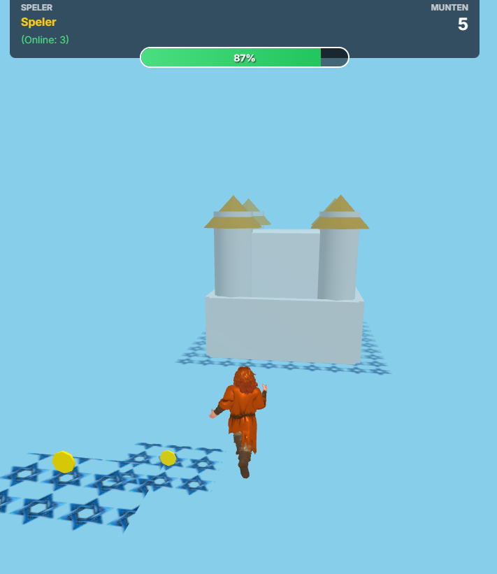

### Leib the game
 A third person RPG platformer.
 ~~ Can you reach the castle of king willem? ~~~

# Amazing features such as...

- platformer with moon! - Can you visit the king?
- 3D renderings of leib!
- including spring easter egg character.
- UFO's!
- Real particles effects!
- Multiplayer!
- Mobile support! (iOS, Android, ..)
- Mountains!
- Coins and Stars! 
- Progress bar and Version number to make sure you are on the latest version!
- Equalized the diversity quota by adding a second character to leib weissman's universe! 
- New and improved Castle of Willem!
- Donation option


# Images
### 
### 

# local setup

Please run `launcher.py` and then navigate to localhost:8000 for testing local development 

 # playwright tests

 ```
 npm init playwright@latest
 npm install --save-dev @playwright/test
 sudo npx playwright install-deps
 npx playwright install
 ```
then
```
npx playwright test
```
or
```
npx playwright test --debug (for debugging steps)
```

 # authors
 - G. M. Kaislscherer
 - L. Weissman
